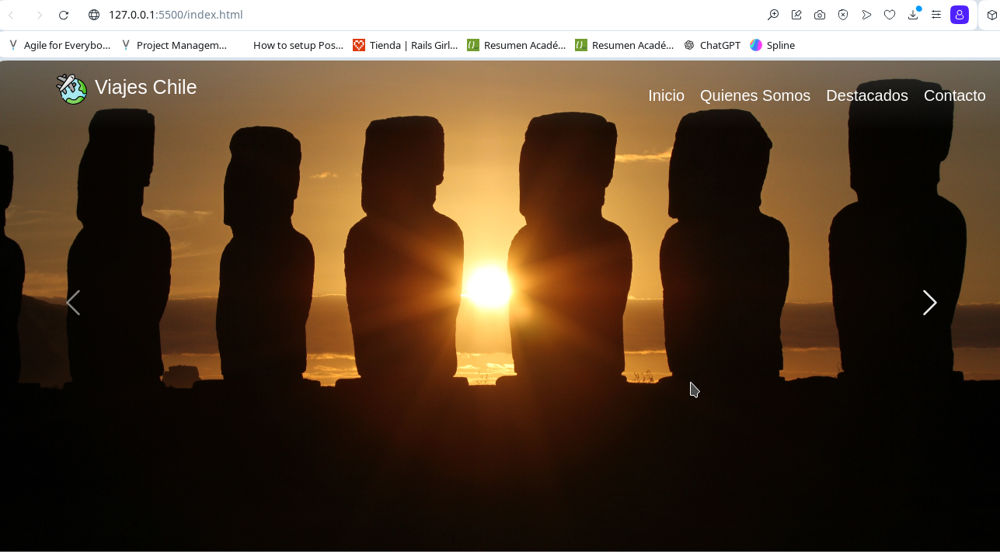
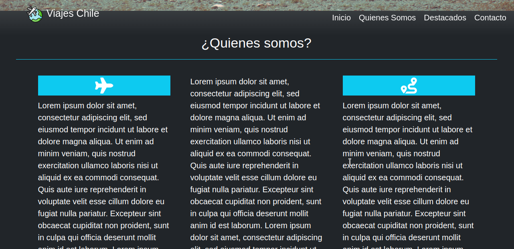
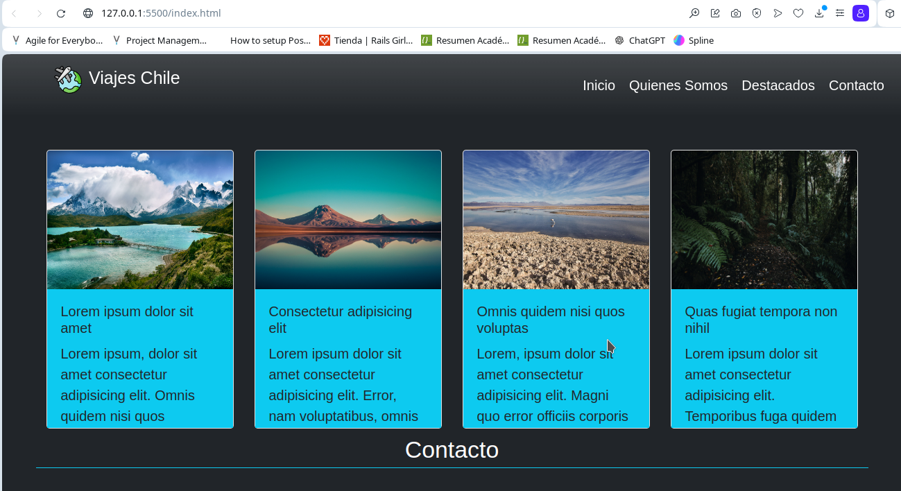
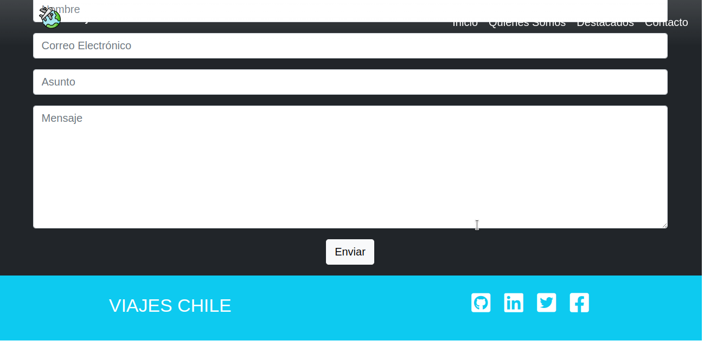

# Viajes Chile
Prueba practica del modulo html, css, bootstrap y jquery del bootcamp de ruby on rails y emprendimiento digital de inforcap.

Descripción del proyecto
Una landing page requerida para un empresa de viajes que promueve el turismo nacional.

Prerrequisitos o Dependencias: html, css, bootstrap y jquery

Sistema Operativo: desarrollado bajo manjaro linux y vscode - ide.

Autor
Miguel Rivas
Repositorio
https://github.com/mrivaslezama/pruebaviajeschile
Url
https://mrivaslezama.github.io/pruebaviajeschile/

Capturas de Pantalla del Proyecto

Vista del inicio

Sección quienes somos

Sección destinos destacados

Sección contacto
